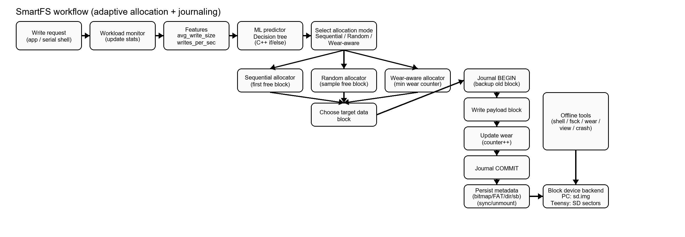
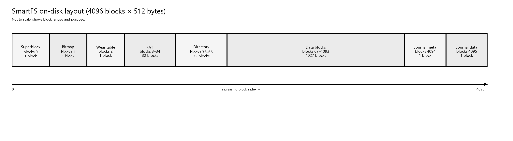

# Summary

Microcontrollers and Internet of Things (IoT) deployments often rely on flash-backed
storage media (SD cards, eMMC, SPI NOR/NAND) for persistent data retention.
A core limitation of flash media is finite program/erase (P/E) endurance: repeated
writes can create localized “hot” regions that fail earlier than the rest of the
device [@gal2005algorithms].

SmartFS is a FAT-style embedded filesystem written in C++17 that targets
bare-metal microcontrollers (Teensy 4.1) and a file-backed PC simulator (`sd.img`).
SmartFS is adaptive: it integrates a TinyML decision tree that selects a block
allocation strategy at runtime based on two live workload features
(average write size and writes per second). The policy switches between three
strategies: Sequential allocation (high throughput for large writes), Random
allocation (scatter small bursts to reduce hot-spotting), and Wear-Aware allocation
(select least-written free blocks). SmartFS also includes a minimal write-ahead
journal for crash recovery, persistent wear tracking, and tooling (`shell`, `fsck`,
`crash`, `wear`, `view`) that makes experiments reproducible.

The file-backed simulator enables full evaluation without dedicated hardware,
while the Teensy port validates the same core logic on a real SD card.

# Statement of need

Embedded storage stacks frequently hard-code a single allocation policy.
FAT on removable media is ubiquitous, but it is not flash-aware and can create
hot-spots and fragmentation for bursty logging workloads [@fat_spec].
Flash-optimized embedded filesystems (e.g., LittleFS [@littlefs], SPIFFS [@spiffs],
YAFFS [@yaffs], JFFS2 [@jffs2]) improve power-loss resilience and distribution of
writes, but their behavior is still primarily fixed by static heuristics.

Real devices often see mixed workloads over time:

- Telemetry logging: many small writes at moderate-to-high frequency.
- Diagnostic snapshots: medium writes at moderate frequency.
- OTA updates / bulk transfer: large sequential writes at low frequency.

These patterns have conflicting needs. A sequential allocator maximizes throughput
and locality for large writes, but can amplify wear and fragmentation under
small frequent bursts. A wear-minimizing allocator spreads writes but can reduce
locality for bulk transfers. SmartFS addresses this by embedding a lightweight,
explainable decision tree classifier (CART) [@breiman1984classification] directly in
the allocation path. The model is trained offline and exported to pure C++
`if/else` logic (no inference runtime, no heap allocation), demonstrating that
TinyML—typically applied to sensing tasks [@tinyml_book]—can also optimize core
OS-like services on resource-constrained microcontrollers.

# Design overview

SmartFS is engineered for microcontroller constraints:

1. Deterministic behavior with bounded overhead per write.
2. No dynamic memory allocation in the hot path.
3. Crash resilience with clear recovery semantics on mount.
4. Pluggable block backend: file-backed `sd.img` for simulation and SdFat sector
   I/O on Teensy.
5. Low barrier for experimentation via interactive shells and standalone tools.

Figure 1 shows the end-to-end write path: monitoring computes features, the
decision tree selects a mode, allocation chooses a physical block, the write is
protected by a journal transaction, and metadata + wear tables are persisted.

{ width=100% }

# On-disk layout

SmartFS uses a fixed, simple block layout that is easy to inspect.
The default simulator image is 2 MiB: 4096 blocks × 512 bytes.

| Region | Blocks | Purpose |
| --- | --- | --- |
| Superblock | 0 | Magic, counters, current allocation mode |
| Free bitmap | 1 | 1-bit free/used map |
| Wear table | 2 | Persistent `uint16_t` wear counters (subset) |
| FAT | 3-34 | Next-block chaining (FAT-style) |
| Directory | 35-66 | Fixed directory table region |
| Data | 67-4093 | Payload blocks |
| Journal | 4094-4095 | Journal meta + backup block |

{ width=85% }

# Adaptive allocation via TinyML

## Feature extraction

SmartFS estimates two workload features from the running write stream.
We denote the mean write size (bytes) and write rate (writes/second) as:

$$\bar{w} = \frac{1}{N}\sum_{i=1}^{N} w_i$$

$$f_w = \frac{N}{T}$$

where $w_i$ is the size of the $i$-th write request, $N$ is the number of writes
observed, and $T$ is the observation window duration in seconds.
In the implementation these are tracked as `avg_write_size` and `writes_per_sec`.

## Decision tree classifier

The embedded predictor (`src/ml_predict.cpp`) maps features to a discrete mode:

- 0: Sequential
- 1: Random
- 2: Wear-Aware

Training is performed offline in Python using scikit-learn and exported to pure
C++ comparisons (no matrix ops, no external runtime) [@scikit_learn].
A representative exported model is shown below:

```cpp
int ml_predict(float avg_write_size, float writes_per_sec)
{
    if (avg_write_size <= 511.4f)
    {
        if (writes_per_sec <= 30.0f)
            return 2; // WEAR_AWARE
        else
            return 1; // RANDOM
    }
    else
    {
        if (writes_per_sec <= 10.0f)
        {
            if (avg_write_size <= 1023.1f)
                return 2; // WEAR_AWARE
            else
                return 0; // SEQUENTIAL
        }
        else
        {
            return 2; // WEAR_AWARE
        }
    }
}
```

Table 1 summarizes the effective decision regions of this tree.

| Condition (avg_write_size, writes_per_sec) | Selected mode |
| --- | --- |
| avg_write_size ≤ 511 B and writes_per_sec > 30 | Random |
| avg_write_size > 1023 B and writes_per_sec < 10 | Sequential |
| Otherwise | Wear-Aware |

## Allocation strategies

Once the mode is selected, SmartFS allocates blocks as follows:

- **Sequential:** choose the first free block in ascending order (locality).
- **Random:** choose uniformly among free blocks (reduces hot-spots).
- **Wear-Aware:** choose the free block with minimum wear counter.

## Training, evaluation, and export

The CART model is trained offline using a synthetic dataset generated by
`ml/generate_dataset.py` and evaluated in `ml/train_models.py` using
scikit-learn [@scikit_learn]. The trained tree is exported to a standalone C++
predictor that can run without an inference runtime or dynamic allocation.

In a representative run (50,000 samples; 80/20 split), a depth-3 decision tree
achieved 0.9999 test accuracy, while a standardized Logistic Regression baseline
achieved 0.9462.

| Model | Test accuracy |
| --- | ---: |
| Decision Tree (depth=3) | 0.9999 |
| Logistic Regression | 0.9462 |

# Crash resilience via a write-ahead journal

Power loss during storage updates can corrupt the filesystem unless operations are
made atomic. SmartFS implements a minimal two-block journal that provides
single-block atomicity by recording the previous block contents before overwriting
a target payload block.

Workflow:

1. `journal.begin(target)`: copy the target’s old contents to the journal region and
   mark the transaction as BEGIN.
2. Write the new payload block.
3. `journal.commit()`: mark COMMIT and clear the journal.

On mount, SmartFS replays the journal:

- If a BEGIN exists without COMMIT, restore the old block (rollback).
- If COMMIT exists but the journal was not cleared, clear the journal.

Journaling is applied to payload block writes inside the write path.
Metadata structures (FAT/bitmap/directory/superblock) are persisted after payload
writes and can be checked with `fsck`; extending journaling to multi-block metadata
transactions is future work. This design is inspired by write-ahead logging
principles [@mohan1992aries].

# Wear tracking

SmartFS tracks a logical wear proxy as a per-block write counter (`uint16_t`).
The counter is incremented on each payload block write and persists across mounts.
The Wear-Aware allocator selects the free block with the minimum recorded counter.

In RAM, the reference implementation tracks wear for all `TOTAL_BLOCKS`.
On disk, the reference layout reserves a single 512-byte wear block (block 2),
persisting 256 counters (512 / 2). Extending persistence to all 4096 blocks would
require reserving 16 blocks (8192 bytes) or compressing the table.
Wear-leveling and write distribution are long-studied problems in flash systems
[@dong2013wear; @gal2005algorithms].

# Tooling and reproducibility

SmartFS includes a PC simulator and standalone tools:

- `shell`: interactive REPL (format/mount/write/read/delete/inspect).
- `crash`: simulates mid-write failure and validates rollback.
- `fsck`: checks consistency between bitmap, FAT, and directory.
- `wear`: prints wear statistics and histograms.
- `view`: visualizes block maps.

The CMake build produces a reusable static library (`smartfs_core`) and the
tool executables above.

This tooling enables repeatable evaluation without hardware, while the Teensy port
enables real-device validation using SdFat sector I/O [@sdfat; @teensy41].

Build (CMake):

```text
cmake -S . -B build
cmake --build build --config Release
```

Minimal simulator session:

```text
shell
smartfs> format sd.img
smartfs> mount sd.img
smartfs> write hello.txt hello
smartfs> fsck
smartfs> unmount
```

The Teensy serial shell exposes a `sync` command to force-save metadata after
interactive sessions.

# Limitations and future work

SmartFS is research-oriented and trades completeness for clarity.
Key limitations:

- Wear persistence currently stores only a subset of counters on disk.
- Metadata is persisted after payload writes; multi-block metadata journaling is not implemented.
- Writes are overwrite-based (no append/partial writes/sparse files).
- Allocation scans are O(B) per block allocation (suitable for the 4096-block image).

Future extensions:

- Persist the full wear table (reserve 16 blocks or compress).
- Extend journaling to multi-block metadata transactions.
- Add append support and partial updates.
- Evaluate on real traces and compare throughput/fragmentation/wear proxy.
- Stabilize mode switching (hysteresis, dwell time, rolling-window features).

# Acknowledgements

This work was conducted as part of academic projects at Amrita Vishwa Vidyapeetham.
We thank the faculty Prajish C. for guidance and support.

# References
